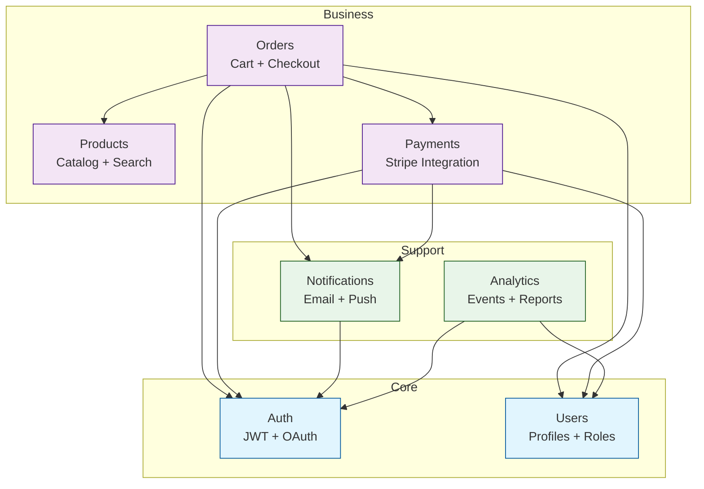
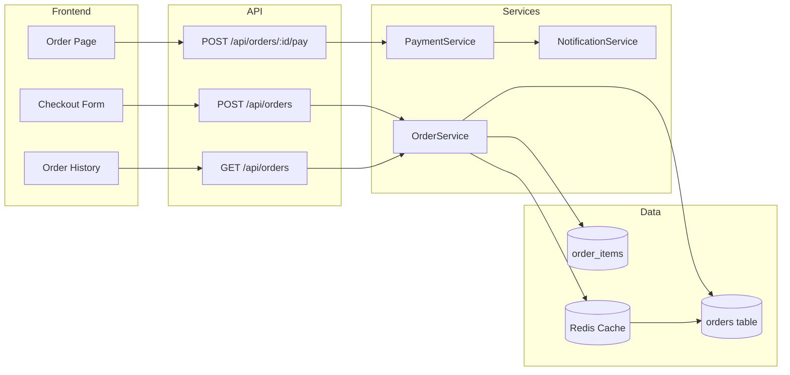
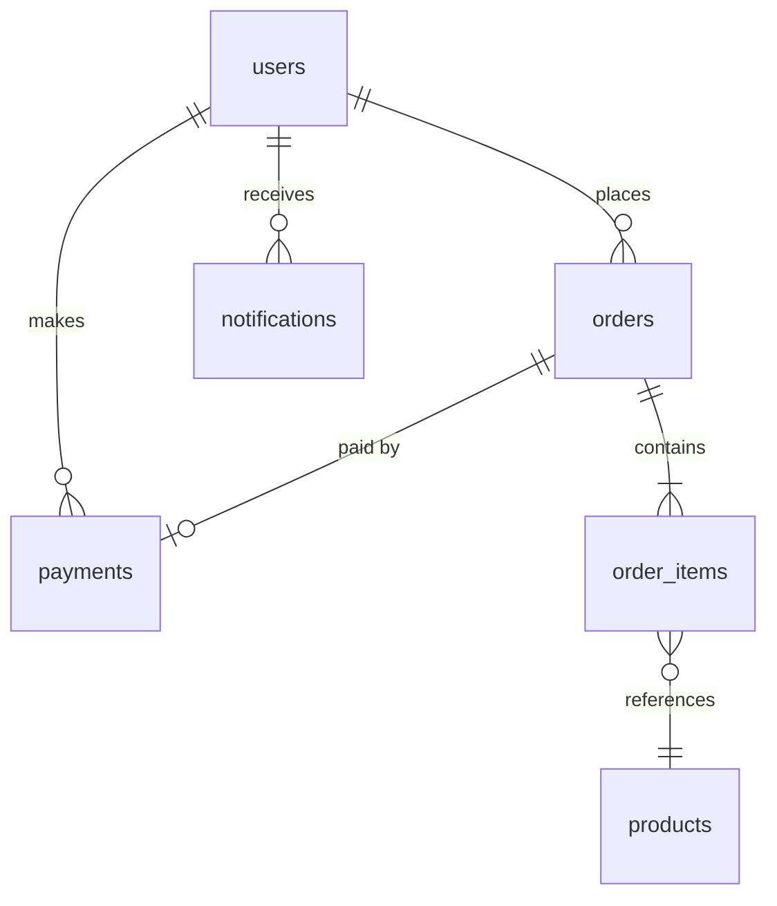

# Feature Map — Codebase Feature Dependency Graph

Map features for: **$ARGUMENTS** (default: entire project)

Build a complete visual map of all features in the codebase, their dependencies, database tables, API endpoints, and frontend pages. Generates Mermaid diagrams and a text report. Works for ANY stack.

**KEY PRINCIPLE: Map what actually exists in the code, not what you assume. Every node in the graph must trace back to real files.**

---

## Step 1: Scan for Features

### 1.1: Detect Project Structure

```bash
# Find all route/controller/handler files (API endpoints)
find . -type f \( -name "*route*" -o -name "*controller*" -o -name "*handler*" -o -name "*view*" -o -name "*endpoint*" -o -name "*api*" \) -not -path "*/node_modules/*" -not -path "*/.git/*" -not -path "*/venv/*" -not -path "*/__pycache__/*"

# Find all service/use-case files (business logic)
find . -type f \( -name "*service*" -o -name "*usecase*" -o -name "*use_case*" -o -name "*manager*" -o -name "*provider*" \) -not -path "*/node_modules/*" -not -path "*/.git/*"

# Find all model/entity/schema files (data layer)
find . -type f \( -name "*model*" -o -name "*entity*" -o -name "*schema*" -o -name "*migration*" \) -not -path "*/node_modules/*" -not -path "*/.git/*"

# Find all frontend pages/components
find . -type f \( -name "page.*" -o -name "Page.*" -o -name "*.page.*" \) -not -path "*/node_modules/*" -not -path "*/.git/*"
find . -type d \( -name "pages" -o -name "views" -o -name "screens" \) -not -path "*/node_modules/*" -not -path "*/.git/*"
```

### 1.2: Identify Features

Group files into features using directory structure and naming patterns:

```
Feature Detection Heuristics:
  Directory-based:    auth/, users/, payments/, products/, search/, etc.
  File-prefix-based:  auth.service, user.controller, payment.model
  Route-based:        /api/auth/*, /api/users/*, /api/products/*
  Table-based:        users, products, orders, payments tables
```

For each feature, collect:

```
FEATURE: [Name]
  Description: [What this feature does — inferred from code]

  Database:
    Tables/Collections: [list with key columns]
    Migrations: [migration files]

  Backend:
    Models/Entities: [file paths]
    Repositories/DAL: [file paths]
    Services: [file paths]
    Controllers/Routes: [file paths]
    Middleware: [file paths, if any]
    DTOs/Schemas: [file paths]

  API Endpoints:
    [METHOD] [path] — [purpose]

  Frontend:
    Pages: [file paths]
    Components: [file paths]
    State/Store: [file paths]
    API Client: [file paths]

  External Dependencies:
    APIs: [third-party APIs used]
    SDKs: [external SDKs]
    Services: [external services — Stripe, SendGrid, etc.]

  Internal Dependencies:
    Depends on: [other features this feature imports/calls]
    Depended by: [other features that import/call this feature]
```

### 1.3: If $ARGUMENTS specifies a single feature

Focus the scan on that specific feature but still map all its dependencies (inward and outward).

---

## Step 2: Map Dependencies Between Features

### 2.1: Code-Level Dependencies

For each feature, trace imports and function calls to other features:

```bash
# For each feature's service files, find imports from other features
# Example: if payments/service.py imports from users/service.py
grep -rn "from.*users\|import.*users" payments/ --include="*.py" --include="*.ts" --include="*.js" --include="*.java"
```

### 2.2: Database-Level Dependencies

Look for foreign keys and join queries between tables:

```bash
# Find foreign key references
grep -rn "REFERENCES\|FOREIGN KEY\|@ManyToOne\|@OneToMany\|@BelongsTo\|@HasMany\|ForeignKey\|relation\|references:" . --include="*.sql" --include="*.py" --include="*.ts" --include="*.js" --include="*.java" --include="*.prisma"

# Find JOIN queries
grep -rn "JOIN\|join\|populate\|include:\|with_\|prefetch_related\|select_related" . --include="*.py" --include="*.ts" --include="*.js" --include="*.java" --include="*.rb"
```

### 2.3: API-Level Dependencies

Look for internal API calls between features (service-to-service):

```bash
# Find internal HTTP calls or service injections
grep -rn "httpClient\|fetch.*api\|axios.*api\|@Inject\|@inject\|Depends(" . --include="*.py" --include="*.ts" --include="*.js" --include="*.java"
```

### 2.4: Build Dependency Matrix

```
DEPENDENCY MATRIX
═════════════════

             Auth  Users  Products  Orders  Payments  Notifications
Auth          -     →       -         -       -          →
Users         ←     -       -         -       -          -
Products      -     -       -         ←       -          -
Orders        ←     ←       ←         -       →          →
Payments      ←     ←       -         ←       -          →
Notifications ←     -       -         ←       ←          -

→ = depends on (imports/calls)
← = depended by (imported/called by)
```

---

## Step 3: Detect Architectural Issues

### 3.1: Circular Dependencies

```
CIRCULAR DEPENDENCY: A → B → C → A
  Feature A imports from Feature B
  Feature B imports from Feature C
  Feature C imports from Feature A

  Severity: HIGH — makes features impossible to deploy independently
  Fix: Extract shared logic into a common module
```

### 3.2: Tight Coupling

```
TIGHT COUPLING: Feature A directly accesses Feature B's database tables
  Instead of: A.service → B.service → B.repository → B.table
  Found:      A.service → B.table (bypassing B's service layer)

  Severity: MEDIUM — breaks encapsulation, makes refactoring dangerous
  Fix: A should call B's service/API, not query B's tables directly
```

### 3.3: God Features

```
GOD FEATURE: [Feature Name] has [N] dependencies and [M] dependents
  This feature is involved in too many things.
  Risk: Changes here break everything.
  Fix: Decompose into smaller, focused features.
```

### 3.4: Orphan Features

```
ORPHAN FEATURE: [Feature Name] has zero dependents
  No other feature depends on this. Is it used?
  Could be: Dead code, standalone utility, or entry point
  Action: Verify if intentional or remove dead code
```

---

## Step 4: Generate Mermaid Diagrams

### 4.1: Feature Dependency Graph



### 4.2: Data Flow Diagram (per feature, if single feature requested)



### 4.3: Database Entity Relationship Diagram



Generate the actual diagrams based on real codebase data, not these examples.

---

## Step 5: Generate FEATURE_MAP.md

```markdown
# Feature Map
**Generated**: [date]
**Project**: [name]
**Total Features**: [count]
**Total Dependencies**: [count]

## Architecture Overview

### Feature Dependency Graph
```mermaid
[generated graph from Step 4.1]
```

### Feature Summary
| # | Feature | Files | Endpoints | Tables | Depends On | Depended By |
|---|---------|-------|-----------|--------|------------|-------------|
| 1 | Auth | [n] | [n] | [n] | [list] | [list] |
| 2 | Users | [n] | [n] | [n] | [list] | [list] |
| ... |

## Feature Details

### 1. Auth
**Description**: [inferred from code]
**Complexity**: Simple | Medium | Complex
**Health**: Good | Needs Attention | Critical

**Database Tables**:
| Table | Key Columns | Relations |
|-------|------------|-----------|
| users | id, email, password_hash | → orders, payments |

**API Endpoints**:
| Method | Path | Purpose | Auth Required |
|--------|------|---------|---------------|
| POST | /api/auth/login | User login | No |
| POST | /api/auth/register | User registration | No |

**Key Files**:
| Layer | File Path |
|-------|-----------|
| Model | [path] |
| Service | [path] |
| Controller | [path] |
| Frontend | [path] |

**Dependencies**:
- Depends on: [none | list with reason]
- Depended by: [list with which features and why]

[... repeat for each feature ...]

## Entity Relationship Diagram
```mermaid
[generated ER diagram from Step 4.3]
```

## Dependency Analysis

### Circular Dependencies
[List any circular dependencies found, or "None detected"]

### Tight Coupling Issues
[List any bypass-layer issues found, or "None detected"]

### God Features (High Fan-In/Fan-Out)
[List features with unusually high dependency counts]

### Orphan Features (No Dependents)
[List features that nothing depends on]

## Architecture Metrics
| Metric | Value | Status |
|--------|-------|--------|
| Total Features | [n] | |
| Average Dependencies/Feature | [n] | [Good/High/Critical] |
| Max Dependencies (single feature) | [n] ([name]) | [Good/High/Critical] |
| Circular Dependencies | [n] | [Good if 0, Critical if > 0] |
| Layer Violations | [n] | [Good if 0] |
| Orphan Features | [n] | [Check if intentional] |
| Test Coverage (features with tests) | [n]/[total] | [percentage] |

## Recommendations
1. [Highest priority architectural improvement]
2. [Second priority]
3. [Third priority]

## Next Steps
- Run `/trace-impact "[change]"` to see impact of proposed changes
- Run `/suggest-ai-features` to discover AI enhancement opportunities
- Run `/refactor [module]` to fix architectural issues
```

---

## Step 6: Output Summary

```
╔══════════════════════════════════════════════════════════════╗
║  FEATURE MAP COMPLETE                                         ║
╠══════════════════════════════════════════════════════════════╣
║  Project: [name]                                              ║
║  Features Found: [count]                                      ║
║  Dependencies Mapped: [count]                                 ║
║                                                               ║
║  Architecture Health:                                         ║
║    Circular Dependencies: [count]                             ║
║    Layer Violations:      [count]                             ║
║    God Features:          [count]                             ║
║    Orphan Features:       [count]                             ║
║                                                               ║
║  Most Connected: [feature name] ([N] dependencies)            ║
║  Most Depended On: [feature name] ([N] dependents)            ║
║                                                               ║
║  Generated: FEATURE_MAP.md (with Mermaid diagrams)            ║
║  Next: /trace-impact or /suggest-ai-features                  ║
╚══════════════════════════════════════════════════════════════╝
```

---

## Critical Rules

1. **Map from code, not assumptions.** Every feature, dependency, and endpoint in the report must have a real file path backing it. Do not invent features that do not exist.

2. **Include ALL layers.** A feature is not just its API endpoint. Map database, backend, frontend, tests, and external dependencies for each feature.

3. **Direction matters.** "A depends on B" is different from "B depends on A". Always show dependency direction clearly.

4. **Mermaid diagrams must be valid.** Test that the generated Mermaid syntax renders correctly. Escape special characters in labels.

5. **Flag architectural issues, do not just report structure.** The value of a feature map is finding circular dependencies, tight coupling, and god features — not just listing files.

6. **Keep it navigable.** For large codebases (20+ features), group features into domains/subgraphs (Core, Business, Support, Infrastructure) to keep the diagram readable.
